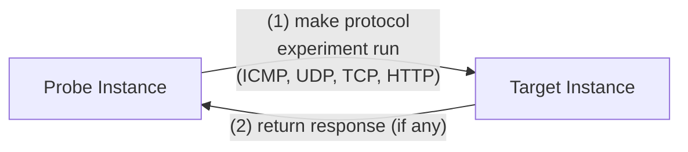
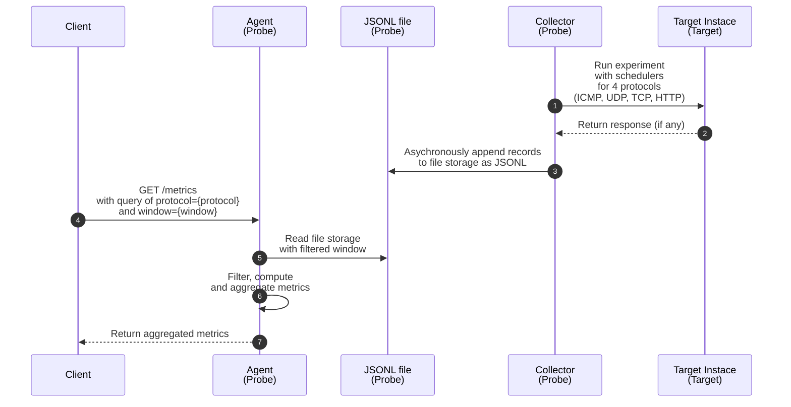
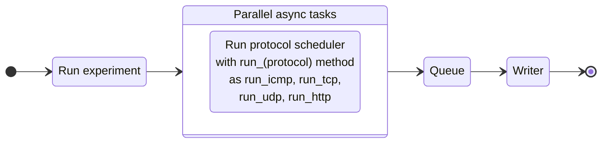
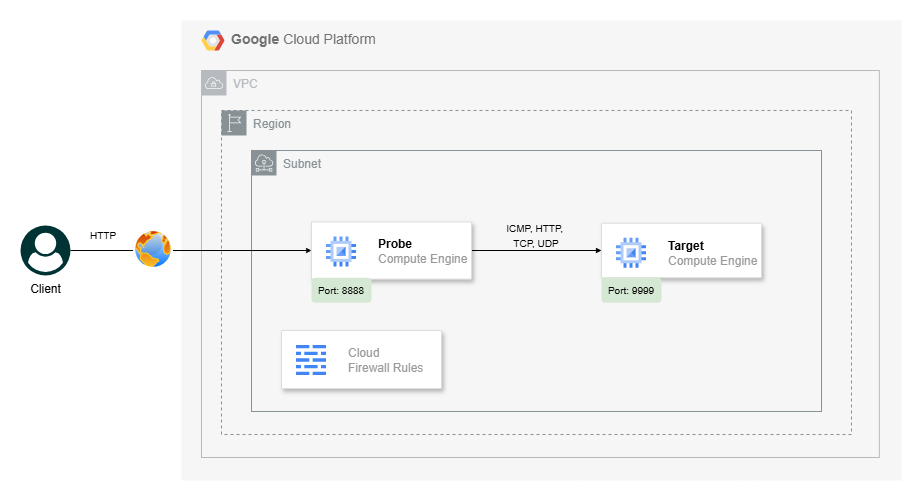
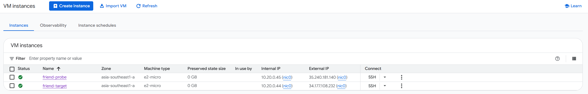
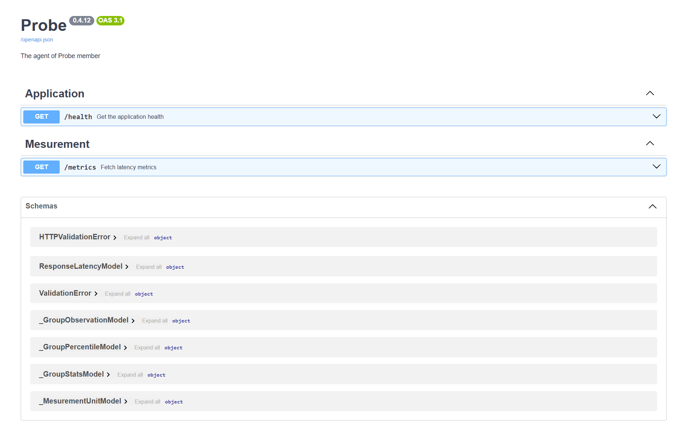

# Snapfire: Server-to-Server Latency Observability

## **Overview**

The **Server-to-Server Latency Observability** project focuses on measuring network latency by calculating the Round-Trip Time (RTT) between a source (Probe) and a destination (Target). RTT represents the total time required for a packet to travel from the Probe to the Target and for the corresponding response to return to the Probe. It is measured in milliseconds (ms) and serves as a primary indicator of end-to-end network performance.

RTT includes:

- The time for packets to propagate from the Probe to the Target.

- The processing delay at the Target.

- The time required for the response to travel back to the Probe.

RTT is measured via 4 different methods: ICMP, UDP, TCP, and HTTP in this project.

Measuring latency with multiple protocols helps pinpoint sources of delay and enables a clearer comparison of RTT to assess system performance.

| Protocol | Components                    | What RTT Represents                                               |
| -------- | ----------------------------- | ----------------------------------------------------------------- |
| ICMP     | Echo Request / Reply          | Pure network-level latency with minimal processing                |
| UDP      | Application-level echo        | Network latency plus lightweight application handling             |
| TCP      | Connection-oriented transport | Network latency plus connection handshake overhead                |
| HTTP     | Application protocol over TCP | End-to-end latency including transport and application processing |

## **Design Concept**

The design concept defines how the system is structured to measure and analyze network latency effectively.
It explains the key architectural choices and how different components work together to ensure reliable, protocol-level RTT measurements.

### **Base Assumptions**

The design concept assumes the following baseline assumptions:

| Group                     | Assumptions                                                                                 |
| ------------------------- | ------------------------------------------------------------------------------------------- |
| Network Topology          | The latency probe (source) and target instances are deployed within the same VPC network    |
|                           | Both instances reside in the same project and region                                        |
|                           | No VPC peering, VPN, or inter-project connectivity is involved                              |
|                           | Each instance is configured with a public (external) IP address                             |
|                           | Communication between components occurs over internal (private) IP addresses                |
| Connectivity & Firewall   | Network connectivity between the probe and target is available                              |
|                           | Required firewall rules (e.g., ICMP and relevant TCP/UDP ports) are allowed                 |
|                           | No additional networking components (load balancers, NAT gateways, or proxies) are required |
| Infrastructure Simplicity | The design emphasizes minimal infrastructure changes                                        |
|                           | The solution prioritizes observability and measurement over network optimization            |
|                           | Deployment is limited to a single region                                                    |
| Measurement               | Latency measurements are performed using HTTP (no TLS/SSL configuration)                    |
|                           | Focus is on transport and application-layer latency rather than encryption overhead         |

### **Pre-default Choices**

The following is a list of pre-default choices and their rationale:

| Category               | Default Choice                             | Rationale                                                                 |
| ---------------------- | ------------------------------------------ | ------------------------------------------------------------------------- |
| Cloud Provider         | Google Cloud Platform (GCP)                | Simple networking model, fast VM provisioning, generous free tier         |
| Infrastructure as Code | Terraform                                  | Declarative configuration, cloud-agnostic, industry-standard tooling      |
| Application Stack      | Python, ASGI (Framework: FastAPI)          | Lightweight framework, readable codebase, rapid development               |
| Automation             | cloud-init via GCP metadata startup script | Fully automated VM bootstrap with no external configuration server needed |

### **Pipeline**

**Environment**:

The pipeline automates the environment between 2 instances,
enabling latency measurement applications to run on the probe instance and the passive target instance.



In that:

- **Probe Instance**: Runs the latency measurement applications

- **Target Instance**: Passive target for network latency checks

**Workflow**:

The pipeline ensures that latency measurements are collected using multiple methods (ICMP, TCP, HTTP) and stored as JSON lines records with timestamps and method identifiers. A lightweight query API processes requests by filtering records based on the requested measurement method and time window (e.g. last 5 minutes), then computes aggregate metrics such as average and percentile latency. Then the output is returned to the client.

The following diagram illustrates the core components of the pipeline:



**Components**:

The following is a list of components and their descriptions:

| Key              | Group | Component | Description                                 |
| ---------------- | ----- | --------- | ------------------------------------------- |
| `[COMPONENT-01]` | Probe | Collector | Runable application to collect latency data |
| `[COMPONENT-02]` | Probe | Agent     | HTTP application serving latency metrics    |

**[COMPONENT-01] Collector (Probe)**:

The collector is a Python application that runs on the probe instance
and is responsible for collecting latency data from the target instance.

| Attribute   | Description                                             |
| ----------- | ------------------------------------------------------- |
| Type        | Application                                             |
| Name        | Probe - Collector                                       |
| Description | The application run experiment and collect latency data |
| Deployment  | Daemon                                                  |
| Language    | Python                                                  |
| Runtime     | Compute Engine, Python 3.12                             |

The collector is designed with the following principles:

- Parallel execution using asynchronous I/O with multiple async tasks

- Decorator-based latency measurement via `@measure_latency`

- Protocol-specific schedulers with separated configurations (e.g., independent timeouts and intervals)

- JSONL-based storage for latency data (one JSON record per line)

- Protocol-specific queues to avoid race conditions and improve performance

- Graceful shutdown with cross-platform support (including Windows)

The workflow is as follows:

(1) Run as daemon with following configurations:

| Argument            | Description                    | Example                            |
| :------------------ | :----------------------------- | ---------------------------------- |
| `--ip`, `--address` | The target instance IP address | `8.8.8.8`                          |
| `--output`          | The path to the JSONL file     | `/mnt/usr/probe/measurement.jsonl` |

and for each protocol, we can set by `--set` with `--set key=value` configurations, as table below:

| Protocol | Required       | Optional                       | Safe Interval |
| -------- | -------------- | ------------------------------ | ------------- |
| ICMP     | `host`         | `timeout`                      | ≥ 1s          |
| TCP      | `host`, `port` | `timeout`                      | ≥ 2–5s        |
| UDP      | `host`, `port` | `timeout`                      | ≥ 2–5s        |
| HTTP     | `url`          | `scheme`, `headers`, `timeout` | ≥ 5–10s       |

(2) Run experiment with schedulers for 4 protocols, ICMP, TCP, UDP, HTTP



(3) Capture latency metrics for each protocol by calling `run_icmp`, `run_tcp`, `run_udp`, and `run_http`

Each probe produces **one measurement** record as JSON format, like example:

```json
{
  "timestamp": "2025-12-30T05:42:18.123Z",
  "protocol": "icmp",
  "target": "8.8.8.8",
  "duration_ms": 23.4,
  "status": "success",
  "reason": null
}
```

(3) Asychronously append records to file storage as JSONL.

- Timestamps use ISO-8601 format in UTC (`Z`)

- Files remain small and append-only

- No database, no schema migrations, and no indexing required

(4) Finished (graceful shutdown)

**[COMPONENT-02] Agent (Probe)**:

The agent is a ASGI application that runs as the probe instance
and is responsible for serving the latency metrics to the client.

| Attribute   | Description                            |
| ----------- | -------------------------------------- |
| Type        | Application                            |
| Name        | Probe - Agent                          |
| Description | The application serves latency metrics |
| Deployment  | Daemon                                 |
| Language    | Python, Framework (FastAPI), uvicorn   |
| Runtime     | Compute Engine, Python 3.12            |
| Expose      | Port `8888`                            |

The agent is designed with the following principles:

- Using async endpoint with query parameters

- Using polars as the engine for read data and using lazy frame for filter, compute, and aggregate metrics

The agent serves the following endpoints:

| Endpoint         | Method | Description                         |
| ---------------- | ------ | ----------------------------------- |
| `/documentation` | GET    | The documentation backed by Swagger |
| `/metrics`       | GET    | Serve latency metrics               |
| `/heahth`        | GET    | Heathcheck for endpoint service     |

For the endpoint `/metrics`:

(1) Parse the query parameters and return the latency metrics for the specified protocol and time window.

| Param      | Description                                            | Example          |
| ---------- | ------------------------------------------------------ | ---------------- |
| `protocol` | One of`icmp`,`udp`, `tcp`, `http`                      | `http`           |
| `window`   | in format `number\|unit`. Unit is one of `m`, `h`, `d` | `5m`, `1h`, `1d` |

(2) Using `pl.scan_ndjson` to read JSONL files with lazy mode

(3) Pre-filter the records by `protocol` and `timeframe` to the cutoff of the current window

(4) Compute and aggregates metrics (avg, p95, max, success_rate)

| Name           | Description                                                                                           |
| -------------- | ----------------------------------------------------------------------------------------------------- |
| `count`        | Total number of records after applying filters (e.g., protocol = `tcp`)                               |
| `success_rate` | Ratio of successful measurements to total measurements (`success_count / total_count`)                |
| `stats`        | Statistics of latency across successful records. Included: min, max, avg, med                         |
| `percentiles`  | Percentiles of latency across successful records. Included: p1, p5, p10, p25, p50, p75, p90, p95, p99 |

(5) Returned JSON response with following fields:

| Name          | Description                                                                |
| ------------- | -------------------------------------------------------------------------- |
| `response_id` | Unique identifier for this response, used for traceability and correlation |
| `timestamp`   | Time when the response was generated, in ISO-8601 UTC format (`Z`)         |
| `status`      | Overall status of the request execution (e.g., `success`, `error`)         |
| `parameters`  | Input parameters used to generate the observation                          |
| `observation` | Aggregated observation results over the selected window                    |
| `percentile`  | Latency percentile measurements                                            |
| `stats`       | Summary statistics for latency values                                      |

```bash
curl "http://localhost:8888/metrics?method=icmp&window=5m"
# {
#   "response_id": "9b609b6aa7d44244a216847b37568606",
#   "timestamp": "2022-07-26T12:34:56.321Z",
#   "status": "success",
#   "parameters": {
#       "protocol": "icmp",
#       "window": "5m"
#   },
#   "observation": {
#       "count": 9999,
#       "success_rate": 0.99
#   },
#   "percentile": {
#       "p25": {"value": 1.2, "unit": "ms"},
#       "p50": {"value": 1.5, "unit": "ms"},
#       "p75": {"value": 1.8, "unit": "ms"},
#       "p90": {"value": 1.88, "unit": "ms"},
#       "p95": {"value": 1.98, "unit": "ms"},
#       "p99": {"value": 2.0, "unit": "ms"}
#   },
#   "stats": {
#       "min": {"value": 0.3, "unit": "ms"},
#       "max": {"value": 2.0, "unit": "ms"},
#       "avg": {"value": 1.6, "unit": "ms"},
#       "med": {"value": 1.5, "unit": "ms"}
#   }
# }
```

### **Data Model**

The data model for latency observations is defined as follows:

| Field name    | Description                                            | Mandatory | Type              | Validation                                                      | Example                      |
| ------------- | ------------------------------------------------------ | --------- | ----------------- | --------------------------------------------------------------- | ---------------------------- |
| `timestamp`   | Time when the latency measurement was captured, in UTC | Yes       | String (ISO-8601) | Must be RFC 3339 / ISO-8601 format, UTC only, ending with `Z`   | `"2025-12-30T05:42:18.123Z"` |
| `protocol`    | Network protocol used to perform the measurement       | Yes       | String (enum)     | One of: `icmp`, `tcp`, `udp`, `http`                            | `"http"`                     |
| `target`      | Destination of the probe (host, IP, or URL)            | Yes       | String            | Must be valid hostname, IPv4/IPv6, or URL depending on protocol | `"api.example.com"`          |
| `duration_ms` | Measured round-trip latency in milliseconds            | Yes       | Number (float)    | Must be ≥ 0; recommended upper bound `< 600000` (10 min)        | `23.47`                      |
| `status`      | Result of the measurement execution                    | Yes       | String (enum)     | One of: `success`, `timeout`, `error`                           | `"success"`                  |
| `reason`      | Optional error or failure explanation                  | No        | String / Null     | Required if `status != success`; empty or null otherwise        | `"connection timeout"`       |

Example combined output:

```json
{"timestamp":"2025-12-30T05:42:18.123Z","protocol":"icmp","target":"8.8.8.8","duration_ms":21.3,"status":"success","reason":null}
{"timestamp":"2025-12-30T05:42:23.456Z","protocol":"tcp","target":"google.com:443","duration_ms":34.1,"status":"success","reason":null}
{"timestamp":"2025-12-30T05:42:28.902Z","protocol":"udp","target":"1.1.1.1:53","duration_ms":null,"status":"timeout","reason":"request timed out"}
{"timestamp":"2025-12-30T05:42:34.017Z","protocol":"http","target":"https://api.example.com/health","duration_ms":128.6,"status":"error","reason":"HTTP 503 Service Unavailable"}
```

Based on the design, the following estimates apply for the data size:

$$
\text{Estimated data size}(x) =
\frac{
  \left( \dfrac{60}{\Delta t} \right)
  \cdot N_{\text{protocols}}
  \cdot 60
  \cdot 24
  \cdot x
  \cdot S_{\text{record}}
}{1024^2}
$$

Where:

- $\Delta t$ = probe interval (seconds)

- $N_\text{protocols}$ = number of protocols

- $x$ = number of days

- $S_\text{record}$ = average record size (bytes)

And following in case of the experiment configuration:

- **4 protocols**: `icmp`, `udp`, `tcp`, `http`

- **Each protocol runs every 5s**

- Total probes: `4 × (60 / 5) = 48 probes/min` -> `2,880 probes/hour` -> `69,120 probes/day`

Average JSONL record size Example record (compact JSON, no whitespace) **≈ 170 bytes per record**

| Part               | Bytes (approx) |
| ------------------ | -------------- |
| Keys + punctuation | ~95 B          |
| Timestamp value    | ~27 B          |
| Protocol           | ~6 B           |
| Target             | ~20–30 B       |
| Numbers + status   | ~15 B          |
| Newline (`\n`)     | 1 B            |

So the average record size is **~170 bytes**

| Period        | Records | Size (realistic) | Size (upper bound) |
| ------------- | ------- | ---------------- | ------------------ |
| 1 hour        | 2,880   | ~0.49 MB         | ~0.58 MB           |
| 1 day         | 69,120  | ~11.2 MB         | ~13.8 MB           |
| 1 month (30d) | ~2.07 M | ~336 MB          | ~414 MB            |

### **Architecture**

The architecture of the system is as follows:



**Components**:

For `probe`:

| Attribute       | Description                                                           |
| --------------- | --------------------------------------------------------------------- |
| Type            | Compute Engine                                                        |
| Name            | `friend-probe`                                                        |
| Resource        | `e2-micro`                                                            |
| Image           | `projects/ubuntu-os-cloud/global/images/family/ubuntu-2404-lts-amd64` |
| Service account | `sa_largo`                                                            |

For `target`:

| Attribute       | Description                                                           |
| --------------- | --------------------------------------------------------------------- |
| Type            | Compute Engine                                                        |
| Name            | `friend-target`                                                       |
| Resource        | `e2-micro`                                                            |
| Image           | `projects/ubuntu-os-cloud/global/images/family/ubuntu-2404-lts-amd64` |
| Service account | `sa_largo`                                                            |

**Networking**:

| Aspect              | Details                                                     |
| ------------------- | ----------------------------------------------------------- |
| Project             | `$PROJECT_ID`                                               |
| Region              | `$PROJECT_REGION`                                           |
| VPC                 | `vpc-network-measurement`                                   |
| Subnet              | Single region, CIDR `10.20.0.0/16`                          |
| VM Roles (via tags) | `probe`, `target`                                           |
| Traffic Policy      | Same behavior as default network, but explicit & controlled |

**Firewall / Traffic Rules**:

| Source   | Destination | Protocol / Port | Allowed | Description                            |
| -------- | ----------- | --------------- | ------- | -------------------------------------- |
| Internet | Probe       | TCP 8888        | Yes     | Only probes exposed to the Internet    |
| Internet | Target      | Any             | No      | Target is isolated from public traffic |
| Probe    | Target      | ICMP            | Yes     | Used for latency measurement (ping)    |
| Probe    | Target      | TCP (HTTP)      | Yes     | HTTP latency measurement               |
| Probe    | Target      | UDP             | Yes     | UDP latency measurement                |
| Target   | Probe       | Any             | No      | Target cannot initiate traffic         |

The design that prioritizes observability and measurement over network optimization has the following benefits:

| Benefit              | Description                                                        |
| -------------------- | ------------------------------------------------------------------ |
| Explicit CIDR        | No implicit addressing; clear IP plan                              |
| Controlled access    | Only required ports/protocols open                                 |
| Role separation      | Probe and target isolated for accurate measurements                |
| Reproducibility      | Same setup can be provisioned consistently across projects/regions |
| Reduced interference | No unnecessary open SSH/RDP or default network noise               |

with the following tradeoffs:

| Decision           | Tradeoff                   |
| ------------------ | -------------------------- |
| Ping-based latency | Simple but coarse-grained  |
| In-memory storage  | Lost on restart            |
| No TLS             | Simplicity over security   |
| cloud-init         | Less flexible than Ansible |

For deployment workflow, please refer to the [Workflow](workflow.md) section.

## **Technical Decisions**

### [Decision] Write records with async mode and queues

Based on the measurement process, there can be multiple tasks writing to the same data file (a single JSONL file) concurrently.
To handle this safely and efficiently, I adopt an asynchronous, batch-oriented writing strategy using asyncio queues.
Each protocol or measurement source feeds data into its respective queue, and the writer task continuously collects records,
buffers them in memory, and writes them in batches to reduce I/O overhead.

Key decisions behind this design:

- Asynchronous processing: Allows the writer to run in parallel with measurement tasks without blocking them.

- Protocol-specific queues: Each protocol has a dedicated queue to isolate data and prevent race conditions.

- Batch writes: Accumulate a configurable number of records (batch_size) before writing to disk, improving I/O efficiency.

- Periodic flush: Even if the batch isn’t full, a flush interval ensures that data is regularly persisted to disk.

- Graceful shutdown: The writer monitors a stop_event and flushes any remaining buffered records before exiting, ensuring no data loss.

This approach provides a robust and scalable way to handle concurrent measurement data while maintaining file integrity and high throughput.

For more details, see the [Appendix: Implement asynchronously write records to JSONL file](#implement-asynchronously-write-records-to-jsonl-file).

### Experiment results

The experiment was run for 1 day to gather latency data (same probe → same target, same time window), and the results are summarized in the following table:

**Latency Summary (by Protocol)**

| Protocol | Records | Success rate | Min  | Max    | p1   | p5   | p25  | p50  | p75  | p90 | p95  | p99  | Notes                                               |
| -------- | ------- | ------------ | ---- | ------ | ---- | ---- | ---- | ---- | ---- | --- | ---- | ---- | --------------------------------------------------- |
| ICMP     | 3,992   | 100%         | 0.85 | 22.82  | 1.02 | 1.10 | 1.25 | 1.46 | 1.87 | —   | 4.54 | 6.01 | Pure network RTT; low baseline, occasional spikes   |
| TCP      | 17,261  | 100%         | 0.79 | 311.13 | 1.47 | 2.01 | 2.76 | 3.49 | 4.26 | —   | 5.60 | 6.98 | Handshake latency; tail affected by retries/backlog |
| UDP      | 17,254  | 100%         | 0.71 | 30.74  | 0.96 | 1.33 | 2.00 | 2.43 | 2.97 | —   | 4.00 | 5.02 | Best-effort transport; stable but no reliability    |
| HTTP     | 17,258  | 100%         | 3.20 | 313.05 | 4.00 | 4.41 | 5.17 | 5.87 | 6.74 | —   | 8.21 | 9.79 | End-to-end latency; includes app + serialization    |

**Notes**:

- All latency values are measured in **milliseconds**

- Percentiles are computed from **successful measurements only**

- The **Notes** column can capture anomalies (e.g., packet loss, retries, partial failures)

- The result fetched by `curl -X 'GET' 'http://$PROBE_AGENT_IP:8888/metrics?protocol={icmp,tcp,udp,http}&window=1d' -H 'accept: application/json'`

## **Appendix**

### **Protocol implementation**

Each protocol measures latency at a different layer of the network stack. Lower-layer protocols isolate raw network behavior, while higher-layer protocols progressively include transport state and application processing. Together, they provide layered visibility into where latency is introduced.

**ICMP**: Measures raw network reachability and RTT at Layer 3, covering routing and kernel-to-NIC processing with no ports or application involvement.

**TCP**: Measures connection setup latency at Layer 4, including port reachability and the three-way handshake, closely reflecting real application connectivity.

**UDP**: Provides best-effort transport latency without connection setup, validating routing and port delivery while allowing loss detection.

**HTTP**: Captures full end-to-end latency at the application layer, including network, transport, application logic, and optional TLS overhead.
The tables below describe the supported latency-measurement methods, the network stack layer they operate on, and the required setup for each protocol.

**Measurement scope by protocol:**

| Way                       | Protocols      | Layer | What it measures         | Includes                          |
| ------------------------- | -------------- | ----- | ------------------------ | --------------------------------- |
| **Network-only**          | ICMP           | L3    | Raw path RTT             | Propagation, queuing, kernel ICMP |
| **Transport (stateless)** | UDP, TWAMP/TDP | L4    | Packet delivery & RTT    | Network + UDP handling            |
| **Transport (stateful)**  | TCP            | L4    | Connection setup RTT     | Network + TCP handshake           |
| **Application-level**     | HTTP / HTTPS   | L7    | End-to-end response time | Network + transport + app         |

Based on the measurement scope of each protocol described above, the following table outlines the required network, firewall, and service configurations needed to run each method in production. The setup varies by protocol layer, reflecting the different dependencies on transport state, application logic, and target-side services.

**Required setup by protocol:**

| Item              | ICMP               | TCP                                | UDP                | HTTP                          |
| ----------------- | ------------------ | ---------------------------------- | ------------------ | ----------------------------- |
| Network           | Same VPC           | Same VPC                           | Same VPC           | Same VPC                      |
| IP                | Internal or Public | Internal or Public                 | Internal or Public | Internal or Public            |
| Firewall          | **Allow ICMP**     | **Allow TCP port** (e.g., 80, 443) | **Allow UDP port** | **Allow TCP port** (80 / 443) |
| Target service    | None               | Optional (port must be open)       | UDP echo server    | HTTP service / endpoint       |
| Application logic | Not required       | Not required                       | Not required       | HTTP handler required         |
| Reliability       | High               | High                               | Best-effort        | High                          |
| Protocol layer    | L3                 | L4                                 | L4                 | L7                            |

### **Sources of Latency**

Latency observed by each probing method depends on how many layers of the network stack are exercised. Lower-layer protocols isolate raw network behavior, while higher-layer protocols progressively include transport state and application processing. This layered approach helps identify _where_ latency is introduced.

### **Latency sources by protocol**

| Stage                  | ICMP        | TCP         | UDP | HTTP                         |
| ---------------------- | ----------- | ----------- | --- | ---------------------------- |
| DNS resolution         | No          | No          | No  | Conditional (hostname-based) |
| Client socket creation | Conditional | Yes         | Yes | Yes                          |
| Kernel → NIC           | Yes         | Yes         | Yes | Yes                          |
| Network routing (L3)   | Yes         | Yes         | Yes | Yes                          |
| Firewall / ACL         | Conditional | Yes         | Yes | Yes                          |
| Server NIC → kernel    | Yes         | Yes         | Yes | Yes                          |
| Port lookup            | No          | Yes         | Yes | Yes                          |
| Connection handshake   | No          | Yes (3-way) | No  | Yes (via TCP)                |
| TLS handshake          | No          | No          | No  | Conditional (HTTPS)          |
| Application accept()   | No          | No          | No  | Yes                          |
| Request parsing        | No          | No          | No  | Yes                          |
| Application processing | No          | No          | No  | Yes                          |
| Response serialization | No          | No          | No  | Yes                          |
| Response transmission  | Yes         | Yes         | Yes | Yes                          |
| Client receive         | Yes         | Yes         | Yes | Yes                          |

Based on the stages exercised above, each protocol covers a different range of OSI layers.

### **OSI layer coverage**

| Protocol | OSI layers involved              | What is exercised                              |
| -------- | -------------------------------- | ---------------------------------------------- |
| ICMP     | L3 – Network                     | Routing and IP reachability                    |
| UDP      | L3 + L4 – Network & Transport    | Routing and port reachability (no reliability) |
| TCP      | L3 + L4 – Network & Transport    | Routing, ports, and connection handshake       |
| HTTP     | L3 → L7 – Network to Application | Network, transport, TLS, and application logic |

As a result, each protocol exposes different latency components and diagnostic value.

### **Latency characteristics by method**

| Category              | Protocol | What you observe | Latency components included          | Typical range | Stability  | Diagnostic value                                   |
| --------------------- | -------- | ---------------- | ------------------------------------ | ------------- | ---------- | -------------------------------------------------- |
| Network-only          | ICMP     | RTT              | Propagation, queuing, kernel ICMP    | 1–100 ms      | High       | Detect routing and congestion issues               |
| Transport (stateless) | UDP      | RTT or timeout   | Network, queuing, UDP stack          | 1–120 ms      | Medium     | Identify loss, firewall, rate limits               |
| Transport (stateful)  | TCP      | Connect time     | Network, queuing, TCP handshake      | 5–200 ms      | Medium     | Detect SYN backlog, load balancer, firewall issues |
| Application-level     | HTTP     | Response time    | Network, TCP, TLS, application logic | 10–1000+ ms   | Low–Medium | Measure user-perceived performance                 |

### **Production Measurement Enhancements**

To harden the probe system for production use, the following enhancements focus on realistic traffic simulation, actionable SLOs, and operational reliability.

(1) Pre-default protocol configuration

Define production-ready default configurations per protocol to ensure measurements reflect real workloads.

- **HTTP protocol**

  - Default to **HTTPS (TLS enabled)**
  - Validate certificates and hostname (SNI)
  - Configurable TLS and request timeouts

- **TCP / UDP**

  - Explicit connection and read timeouts

- **ICMP**

  - Rate-limited probes to avoid network noise

These defaults provide consistent, secure, and comparable measurements across environments.

(2) More specific result interpretation and root-cause mapping

By correlating results across multiple protocol probes, failures and latency patterns can be mapped to likely root causes. This multi-signal approach reduces false positives and accelerates diagnosis by identifying the lowest affected layer.

**Cross-protocol diagnosis matrix**

| ICMP | TCP  | UDP  | HTTP         | Likely root cause                                      |
| ---- | ---- | ---- | ------------ | ------------------------------------------------------ |
| Fail | Fail | Fail | Fail         | Network outage or routing failure                      |
| Pass | Fail | Fail | Fail         | Firewall rule or port blocked                          |
| Pass | Pass | Fail | Fail         | UDP filtered or target expects UDP response            |
| Pass | Pass | Pass | Fail         | Application unavailable or misconfigured               |
| Fast | Fast | Fast | Slow         | Application logic, database, or cache latency          |
| Slow | Slow | Slow | Slow         | Network congestion or saturation                       |
| Fail | Pass | Fail | Fail         | ICMP blocked (common in production environments)       |
| Pass | Fail | Pass | Fail         | TCP blocked while UDP allowed                          |
| Pass | Pass | Pass | Intermittent | Load balancer instability, autoscaling, or cold starts |

(3) Flow-based SLOs and actions

Define layered SLOs that map **OSI layers → protocol probes → diagnosis → action**, enabling fast root-cause isolation.

| Layer            | Indicator                   | SLO      |
| ---------------- | --------------------------- | -------- |
| Network (L3)     | ICMP success rate           | ≥ 99.9%  |
| Transport (L4)   | TCP handshake latency (p95) | < 50 ms  |
| Application (L7) | HTTP latency (p95)          | < 300 ms |
| Application      | HTTP availability           | ≥ 99.5%  |

- Evaluate burn rate at multiple windows (fast / slow)

- Trigger actions based on the **lowest failing layer**

(4) Persistent storage for measurements

Use persistent storage to prevent data loss during instance restarts or re-creation.

- Persistent disk or managed database

- Optional local buffering with flush on shutdown

- Enables historical analysis and SLO evaluation

### **Implement asynchronously write records to JSONL file**

For the implement, I use [asyncio](https://docs.python.org/3/library/asyncio.html) and [aiofiles](https://pypi.org/project/aiofiles/).

=== "(Selected method) Idea: async with queue"

    ```python
    queue = asyncio.Queue()

    # Producers
    await queue.put(record)

    # Single writer coroutine
    while True:
        record = await queue.get()
        async with aiofiles.open(output, "a") as f:
            await f.write(json.dumps(record) + "\n")
        queue.task_done()
    ```

=== "Idea: async write lock"

    ```python
    # Create single global lock
    WRITE_LOCK = asyncio.Lock()

    Use it when writing:
    async with WRITE_LOCK:
        async with aiofiles.open(output, "a") as f:
            await f.write(json.dumps(record) + "\n")
    ```

### **Screenshot**

From the expoeriments, the following screenshots were taken:

**Compute instances:**

The instances provisioned are `friend-probe` and `friend-target`



**Endpoints:**


